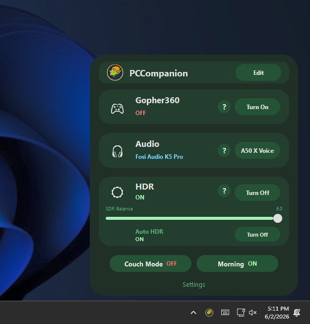
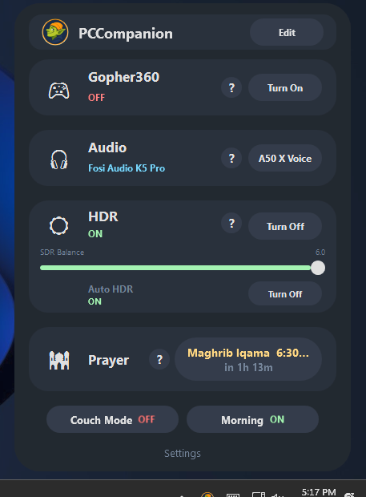
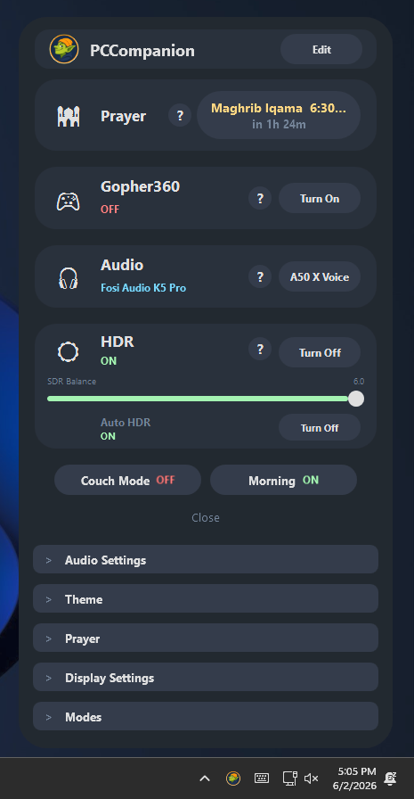
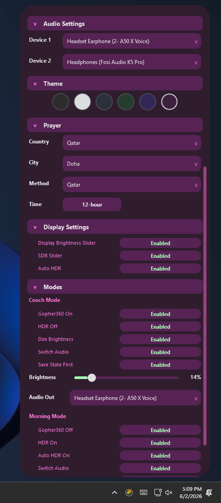
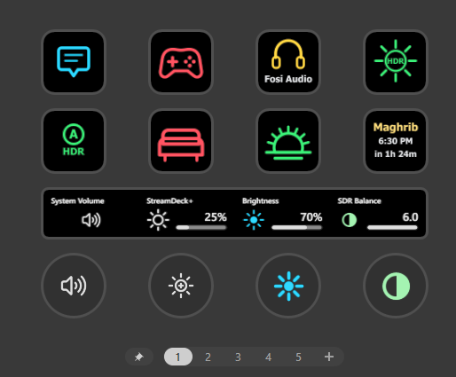

# PC Companion

[](https://github.com/Ski-24/PC-Companion/releases/latest)
[](https://github.com/Ski-24/PC-Companion/releases)
[](https://github.com/Ski-24/PC-Companion/commits/main)
[](https://github.com/Ski-24/PC-Companion/commits/main)
[](https://github.com/Ski-24/PC-Companion)
[](https://github.com/Ski-24/PC-Companion)
[](#license)

A lightweight Windows system-tray companion app (WPF, .NET 8). Left-click the tray icon
to open a popup that anchors above the taskbar, with four feature cards plus two one-tap
"scene" buttons — and an optional Stream Deck plugin to drive it all from your deck.

<p align="center">
  
  &nbsp;
  
</p>

## Features

Every card has an in-app **( ? ) Help** button; the descriptions below mirror it.

- **Gopher360** — turn the Gopher360 driver on/off so your game controller acts as a
  mouse/keyboard. Controls and cursor speed come from Gopher360's own `config.ini`; if the
  cursor feels too fast or slow, tweak that config. (See the
  [Gopher360 GitHub page](https://github.com/Tylemagne/Gopher360) for advanced controls.)

- **Audio** — switches the Windows default playback device between your two configured
  outputs. If switching stops working, a device's name probably changed (driver update,
  reconnect, or a Windows rename) — just re-select the devices in **Settings**.

- **Display** — the HDR / display card:
  - **HDR** toggle and **Auto HDR** toggle.
  - **Display Brightness** drives your monitor over **DDC/CI**. If it doesn't work: enable
    DDC/CI in the monitor's own menu, turn **Eco Mode** off, and try disabling
    G-Sync/FreeSync/VRR or ELMB/ULMB motion-blur reduction. Some docks/adapters block
    DDC/CI entirely.
  - **SDR Balance** adjusts SDR-content brightness while HDR is on. It's app-controlled and
    may not *exactly* mirror the Windows Settings slider.

- **Prayer Times** — next prayer name + live countdown, **calculated offline** as estimates.
  The app computes prayer times internally and then applies your **iqama offsets**, so the
  card shows the *iqama* time (not the adhan time). Adjust the offsets to match your local
  mosque or timetable. Per-country calculation presets are included.

- **Couch / Morning modes** — two configurable one-tap "scenes" that batch several actions
  and restore them on toggle-off (e.g. **Couch**: Gopher on, HDR off, dim brightness, switch
  audio; **Morning**: the wake-up counterpart). They're mutually exclusive, and each button
  stays in a dimmed **"Setup"** state until you configure it in **Settings**.

The popup anchors to the bottom-right of the current monitor's work area and scrolls
internally on small / high-DPI displays. Everything is configured in the popup's own
collapsible **Settings** — audio devices, theme, prayer location/method, display toggles,
and the Couch/Morning scenes:

<p align="center">
  
  &nbsp;
  
</p>

## Download & install

> **Most users want this section.** No SDK, no runtime, no admin rights.

1. Download the latest **`PCCompanion-Setup-1.0.0.exe`** from the
   [**Releases**](https://github.com/Ski-24/PC-Companion/releases/latest) page.
2. Run it. During setup you can tick:
   - **Create a desktop shortcut** (off by default)
   - **Start PC Companion when I sign in to Windows** (on by default — launches silently to the tray)
   - **Install Stream Deck support** (off by default — see below)
3. Launch it from the Start Menu (or it starts itself at next sign-in).

**Requirements:** 64-bit Windows 10 or 11. **That's it** — the build is self-contained,
so the .NET runtime is bundled in and nothing else needs installing. It installs per-user
to `%LocalAppData%\PC Companion` (no UAC prompt) and registers a normal entry under
**Settings → Apps** / **Control Panel → Programs**, so you can update or remove it like any
other app.

> ⚠️ **SmartScreen:** the installer is not code-signed, so Windows may show a blue
> *"Windows protected your PC"* prompt the first time. Click **More info → Run anyway**.

**Uninstall:** Settings → Apps → *PC Companion* → Uninstall. It preserves your settings by
default (it asks before removing your config or any Stream Deck files it installed).

## Stream Deck support

The optional plugin is a **controller layer** — it doesn't replace the app; it calls the
installed `PCCompanion.exe` so the app remains the single backend that actually does the
work (HDR, audio, Gopher360, modes…). Keys show live status read from the app.

<p align="center">
  
</p>

- **Keypad actions:** Show Popup, Toggle Gopher360, Switch Audio, Prayer, Toggle HDR,
  Toggle Auto HDR, Toggle Couch Mode, Toggle Morning Mode
- **Stream Deck + dials:** Display Brightness, SDR Balance

**Install it** via the installer checkbox above (recommended). The installer copies the
plugin to `%AppData%\Elgato\StreamDeck\Plugins\com.abdulla.pccompanion.sdPlugin`, detects
an existing copy (offering repair/skip), and only ever touches its own plugin folder. By
default each action points at the installed `%LocalAppData%\PC Companion\PCCompanion.exe`,
so there's nothing to configure — the per-action **EXE path** field is only needed if you
installed the app somewhere custom. Restart the Stream Deck app if the actions don't appear.

## Build from source (developers)

**Prerequisites**

| To build… | You need |
|-----------|----------|
| The app | [.NET 8 SDK](https://dotnet.microsoft.com/download) |
| The installer | [Inno Setup 6](https://jrsoftware.org/isdl.php) (`winget install JRSoftware.InnoSetup`) |
| The Stream Deck plugin | [Node.js 20+](https://nodejs.org) |

**Build & run the app**

```powershell
git clone https://github.com/Ski-24/PC-Companion.git
cd PC-Companion
dotnet build App\PCCompanion\PCCompanion.csproj -c Debug
.\App\PCCompanion\bin\Debug\net8.0-windows\PCCompanion.exe
```

Or open `App\PCCompanion\PCCompanion.csproj` in Visual Studio 2022 (17.8+) and press F5.

**Publish a standalone build** (what the installer packages — produces the self-contained,
single-file exe plus the WPF native DLLs):

```powershell
dotnet publish App\PCCompanion\PCCompanion.csproj -r win-x64 -c Release `
    --self-contained -p:PublishSingleFile=true -o publish
```

**Build the installer** (after publishing to `publish\`):

```powershell
& "${env:LOCALAPPDATA}\Programs\Inno Setup 6\ISCC.exe" Installer\PCCompanion.iss
# or wherever ISCC.exe lives; output lands in Installer\Output\
```

**Build the Stream Deck plugin:**

```powershell
cd StreamDeckPlugin
npm install
npm run build      # compiles src\*.ts -> com.abdulla.pccompanion.sdPlugin\bin\plugin.js
```

> **Build notes (real ones for this project):**
> - It targets `net8.0-windows`; if the build complains about the target framework,
>   install the **.NET 8 SDK** (the link above), not just the runtime.
> - The legacy WinForms version under `App\PCControlApp.winforms-backup\` is **not** part
>   of the maintained app — don't build it.
> - `install-to-programfiles.ps1` is the old machine-wide dev installer, superseded by the
>   Inno Setup installer above.

## Configuration & logs

Settings and logs live under **`%LocalAppData%\PCCompanion`** (note: no space — separate
from the install dir `%LocalAppData%\PC Companion`). They are **not** in the repo and are
preserved across updates/reinstalls: `Config\settings.json`, state files, daily
`Logs\app-YYYY-MM-DD.log`, and `status.json` (the live status the Stream Deck plugin reads).

## Project layout

| Path | Purpose |
|------|---------|
| `App/PCCompanion/` | The WPF app (C# namespace `PCCompanion`) |
| &nbsp;&nbsp;`PopupWindow.xaml(.cs)` | Tray popup, the four cards, and the mode buttons |
| &nbsp;&nbsp;`*Service.cs` / `*Manager.cs` | Feature logic (brightness, HDR, SDR, audio, gopher) |
| &nbsp;&nbsp;`Prayer*.cs` | Prayer-time calculation, presets, countdown |
| &nbsp;&nbsp;`AppPaths.cs` | Runtime data location |
| `StreamDeckPlugin/` | The Elgato Stream Deck plugin (TypeScript; built with rollup) |
| `Installer/PCCompanion.iss` | Inno Setup installer script |
| `Tools/Gopher360/` | Gopher360 binary, embedded into the EXE at build time |
| `Icons/` | App icon (embedded) |
| `Scripts/` | Legacy standalone PowerShell helpers (superseded by the C# managers) |

## Tech notes

- **Stack:** .NET 8, WPF with `UseWindowsForms=true` (the tray icon uses `NotifyIcon`);
  the Stream Deck plugin is TypeScript on the Elgato SDK v2 (Node 20).
- The source currently contains some temporary diagnostic logging (`DisplayDiag.cs`,
  `DIAG-*` log lines) used to investigate an intermittent display-dimming issue.

## Credits & license

This app bundles **[Gopher360](https://github.com/Tylemagne/Gopher360)** (embedded as a
resource) — full credit to its authors.

Gopher360 is free software, licensed under the **GNU General Public License v3**: you can
redistribute it and/or modify it under the terms of the GPL as published by the Free
Software Foundation, either version 3 of the License, or (at your option) any later version.

This program is distributed in the hope that it will be useful, but **WITHOUT ANY
WARRANTY**; without even the implied warranty of MERCHANTABILITY or FITNESS FOR A PARTICULAR
PURPOSE. See the GNU General Public License for more details
(<http://www.gnu.org/licenses/>).

> Because Gopher360 (GPLv3) is redistributed inside this project, the combined work is
> effectively distributed under the **GPLv3** as well. Add a `LICENSE` file containing the
> full GPLv3 text to make this explicit.
</content>
